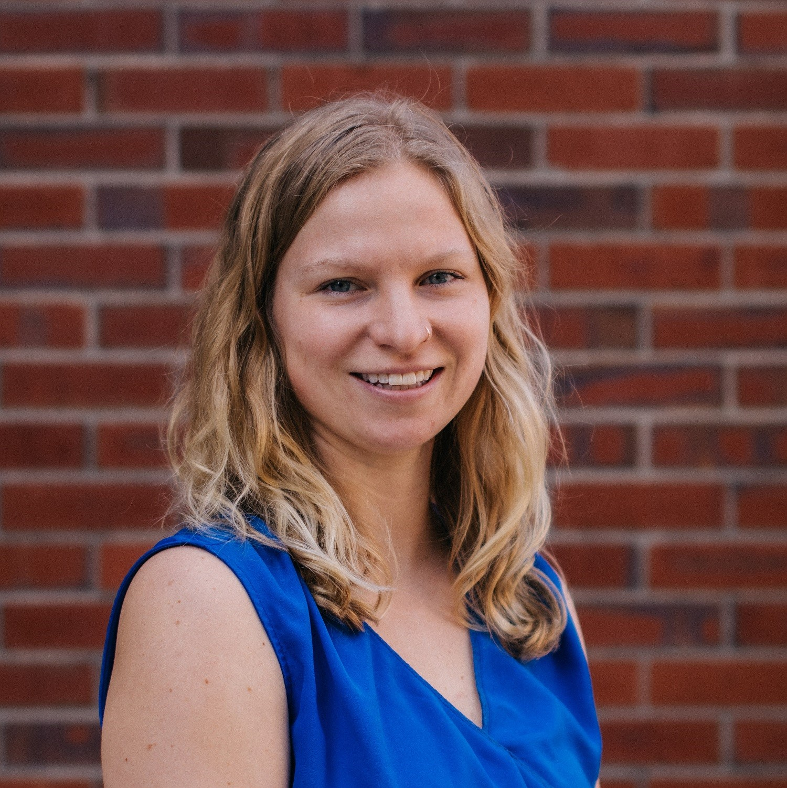

```{r setup, include=FALSE}
knitr::opts_chunk$set(echo = FALSE)

# Learn more about creating websites with Distill at:
# https://rstudio.github.io/distill/website.html

```

{width=50%} 

## Bio
I am a PhD Candidate in the [**Lester Lab**](https://www.lester-lab.com) and the [**Department of Geography**](https://www.geography.fsu.edu) at Florida State University. I study the biogeography and socio-ecological linkages of marine ecosystems within the context of global climate change and other human stressors. I am most passionate about research questions that can inform effective marine conservation and resource management under increasing anthropogenic pressures. While my past research and dissertation work have primarily focused on benthic ecosystems in the Northwest Atlantic and seagrass ecosystems in the Gulf of Mexico, I am broadly interested in research questions and problems that could be generalized and applied to other coastal and marine systems.  My approach to research combines a mix of data science in R, GIS & spatial modeling, field observational studies, and laboratory analyses and incorporates both interdisciplinary collaboration and the mentoring of undergraduate trainees. 

## Research Themes

* Biogeography & Macroecology

* Ecosystem Functions & Services

* Climate Change

* Marine Conservation Science

* Spatial Planning

## Education: 
* PhD Candidate, Geography, Department of Geography, Florida State University (2017-Present) 

* Dual M.Sc., Marine Biology & Marine Policy, School of Marine Science, University of Maine (2014)

* B.Sc., Marine Science, School of Marine Sciences, University of Maine (2010)  

## Contact Information: 
Jennifer McHenry

113 Collegiate Loop

Bellamy Building, Room 307

PO Box 3062190

Tallahassee FL 32306-2190

[**jamchenry@fsu.edu**](jamchenry@fsu.edu)